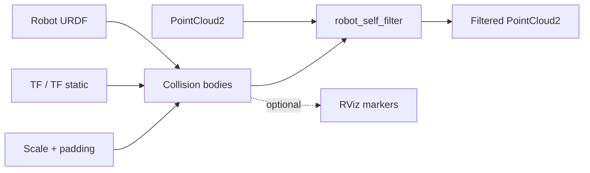

<div align="center">

# robot_self_filter

**Fast, tested robot-body filtering for ROS 2 point clouds.**

[](https://docs.ros.org/en/jazzy/)
[](https://github.com/leggedrobotics/robot_self_filter/releases/latest)
[](LICENSE)
[](CMakeLists.txt)

[Overview](#overview) · [Quick start](#quick-start) · [Configuration](#configuration) · [Interfaces](#interfaces) · [Performance](#performance-and-verification)

</div>

---

## Overview

`robot_self_filter` removes LiDAR points that belong to the robot itself. It builds collision bodies from the robot URDF, follows their poses through TF, and classifies each point as outside, inside, or shadowed by the robot.

| | |
| --- | --- |
| **Sensor layouts** | Generic XYZ/XYZRGB, Ouster, Hesai, Robosense, and Pandar |
| **Collision geometry** | Sphere, box, cylinder, and convex mesh |
| **Output modes** | Compact, organized, inverted, zero-filled, or NaN-filled |
| **Debugging** | Optional collision-shape markers for RViz |
| **Reference performance** | **27.4% higher aggregate median throughput** in v1.1.0 |



## Quick start

### 1. Build on ROS 2 Jazzy

```bash
mkdir -p ~/robot_self_filter_ws/src
cd ~/robot_self_filter_ws/src
git clone --branch v1.1.0 https://github.com/leggedrobotics/robot_self_filter.git

cd ..
source /opt/ros/jazzy/setup.bash
rosdep install --from-paths src --ignore-src -r -y
colcon build --packages-select robot_self_filter \
  --cmake-args -DCMAKE_BUILD_TYPE=Release
source install/setup.bash
```

### 2. Create a filter configuration

```yaml
self_filter:
  ros__parameters:
    sensor_frame: lidar_link
    keep_organized: false
    invert: false
    min_sensor_dist: 0.3

    default_sphere_padding: 0.01
    default_box_padding: [0.01, 0.01, 0.01]
    default_cylinder_padding: [0.01, 0.01]

    self_see_links:
      names: [base_link, arm_link_1, arm_link_2]
```

See [`params/example.yaml`](params/example.yaml) for a construction-equipment example with per-link overrides.

### 3. Launch

```bash
ros2 launch robot_self_filter self_filter.launch.py \
  robot_description:="$(xacro /path/to/robot.urdf.xacro)" \
  filter_config:=/path/to/self_filter.yaml \
  in_pointcloud_topic:=/lidar/points \
  out_pointcloud_topic:=/lidar/points_filtered \
  use_sim_time:=false
```

> [!TIP]
> Subscribe an RViz `MarkerArray` display to `/collision_shapes` while tuning padding. Marker construction is skipped when no subscriber is present.

## Configuration

The filter reads collision geometry from `robot_description`. Global defaults can be overridden per link beneath `self_see_links`.

| Shape | Scale | Padding |
| --- | --- | --- |
| Sphere | scalar | scalar |
| Box | `[x, y, z]` | `[x, y, z]` |
| Cylinder | `[radial, axial]` | `[radial, axial]` |
| Mesh | URDF geometry | Not configurable |

```yaml
self_filter:
  ros__parameters:
    default_box_scale: [1.0, 1.0, 1.0]
    default_box_padding: [0.01, 0.01, 0.01]

    self_see_links:
      names: [base_link, boom_link]

      boom_link:
        box_scale: [1.0, 1.0, 1.1]
        box_padding: [0.03, 0.05, 0.08]
        shadow: false
```

`shadow` defaults to `true`. Set it to `false` when coarse collision geometry touches the
sensor aperture and should still reject contained robot points without removing terrain rays
behind that link.

<details>
<summary><strong>Launch arguments</strong></summary>

| Argument | Default | Description |
| --- | --- | --- |
| `robot_description` | Required | Expanded robot URDF string |
| `filter_config` | Required | Path to the filter YAML file |
| `in_pointcloud_topic` | `/cloud_in` | Input topic remapping |
| `out_pointcloud_topic` | `/cloud_out` | Output topic remapping |
| `lidar_sensor_type` | `2` | Point layout selector; see below |
| `zero_for_removed_points` | `true` | Zero removed points when organized output is enabled |
| `use_sim_time` | `true` | Use the ROS simulation clock |
| `description_name` | `/robot_description` | Legacy name remapping for the robot description |

</details>

<details>
<summary><strong>Core node parameters</strong></summary>

These are node defaults. The supplied launch file overrides some of them as shown above.

| Parameter | Default | Description |
| --- | --- | --- |
| `sensor_frame` | `Lidar` | Sensor TF frame; empty selects containment-only filtering |
| `lidar_sensor_type` | `0` | Input point-field layout |
| `in_pointcloud_topic` | `/cloud_in` | Input topic used by the node |
| `max_queue_size` | `10` | Sensor-data subscription history depth |
| `keep_organized` | `false` | Preserve input width and height |
| `zero_for_removed_points` | `false` | Use zeros instead of NaNs for organized removed points |
| `invert` | `false` | Keep robot points instead of removing them |
| `min_sensor_dist` | `0.01` | Minimum accepted distance from the sensor, in metres |
| `publish_collision_shapes` | `true` | Publish markers when a subscriber exists |
| `self_see_links.names` | `[]` | URDF links included in the self mask |
| `self_see_links.<link>.shadow` | `true` | Reject rays intersecting this link; containment filtering is always active |

</details>

### Sensor layouts

| Value | Sensor layout | PCL point type |
| ---: | --- | --- |
| `0` | Generic XYZ | `pcl::PointXYZ` |
| `1` | Generic XYZRGB | `pcl::PointXYZRGB` |
| `2` | Ouster | `PointOuster` |
| `3` | Hesai | `PointHesai` |
| `4` | Robosense | `PointRobosense` |
| `5` | Pandar | `PointPandar` |

## Interfaces

| Direction | Topic | Type | QoS / purpose |
| --- | --- | --- | --- |
| Subscribe | `/cloud_in` | `sensor_msgs/msg/PointCloud2` | Sensor data QoS; remappable |
| Subscribe | `/tf` | `tf2_msgs/msg/TFMessage` | Dynamic link transforms |
| Subscribe | `/tf_static` | `tf2_msgs/msg/TFMessage` | Static link transforms |
| Publish | `/cloud_out` | `sensor_msgs/msg/PointCloud2` | Filtered cloud, sensor data QoS |
| Publish | `/collision_shapes` | `visualization_msgs/msg/MarkerArray` | Optional debug geometry |

## Tuning workflow

1. Start with scale `1.0` and padding between `0.01` and `0.05` metres.
2. Visualize `/collision_shapes` in RViz.
3. Confirm the URDF collision geometry and TF frames align with the cloud frame.
4. Apply per-link overrides only where the global defaults are insufficient.
5. Validate both close-range robot removal and preservation of nearby environment points.

<details>
<summary><strong>Troubleshooting</strong></summary>

| Symptom | Checks |
| --- | --- |
| Robot points remain | Check `sensor_frame`, TF connectivity, collision geometry, and link names; then increase padding carefully |
| Environment points disappear | Reduce padding/scale and verify `min_sensor_dist` |
| No output cloud | Confirm the input topic, remappings, `robot_description`, and YAML node key (`self_filter`) |
| High CPU usage | Reduce filtered links, simplify collision meshes, and disable unused marker subscriptions |
| Organized output looks invalid | Check `keep_organized` together with `zero_for_removed_points` |

</details>

## Performance and verification

Version 1.1.0 was measured against baseline revision `8910134` on the same Intel Core Ultra 7 258V system, using identical Release builds, deterministic inputs, 8 warmups, and 21 measured iterations.

| Cloud size | Baseline | v1.1.0 | Change |
| ---: | ---: | ---: | ---: |
| 20k points | 7.250 M points/s | 9.401 M points/s | **+29.7%** |
| 100k points | 7.425 M points/s | 9.372 M points/s | **+26.2%** |
| 400k points | 7.422 M points/s | 9.377 M points/s | **+26.3%** |

Aggregate geometric-mean improvement: **27.4%**, with identical classification checksums in every case.

```bash
colcon build --packages-select robot_self_filter \
  --cmake-args -DCMAKE_BUILD_TYPE=Release -DBUILD_TESTING=ON
colcon test --packages-select robot_self_filter --return-code-on-test-failure
colcon test-result --verbose

python3 src/robot_self_filter/test/compare_benchmarks.py \
  src/robot_self_filter/benchmark/results/baseline_8910134.csv \
  src/robot_self_filter/benchmark/results/optimized_v1.1.0.csv
```

The suite covers geometry boundaries, NaNs, organized/inverted outputs, every supported custom point layout, installed-node ROS behavior, clean shutdown, sanitizers, and downstream target consumption. Full release evidence is recorded in [`RESULT.md`](RESULT.md).

## Contributing

Bug reports and focused pull requests are welcome. Please include a regression test for behavior changes and benchmark evidence for hot-path changes.

## License and credits

Licensed under the [BSD 3-Clause License](LICENSE).

ROS 2 port and maintenance by [Lorenzo Terenzi](mailto:lterenzi@ethz.ch). Original ROS 1 implementation by Eitan Marder-Eppstein and contributors.
